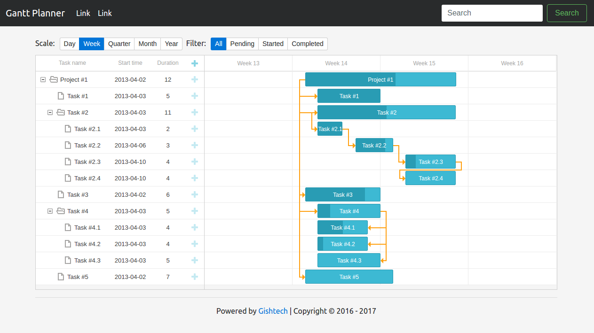

# Gantt Planner

An advanced planning tool using gantt charts implemented with the help of the [DHTMLX Gantt Chart Library](https://docs.dhtmlx.com/gantt/), [Ember.js](https://www.emberjs.com/) and [Ruby on Rails](http://rubyonrails.org/).



## Client-side JavaScript

We will create an [Ember component](https://guides.emberjs.com/v2.13.0/components/defining-a-component/) to insert a Gantt Chart onto a given page and processing a task list like this:

```
{{gantt-chart tasks=tasks}}
```

### Ember component

`RAILS_ROOT/frontend/app/components/gantt-chart.js`

```javascript
/* global gantt :true */
import Ember from 'ember';

export default Ember.Component.extend({
  classNames: ['gantt-chart'],
  cid: null,
  tasks: null,
  scale_units: [
        {
            scale_unit: 'Day',
            date_scale: '%j %F'
        },
        {
            scale_unit: 'Week',
            date_scale: 'Week %W'
        },
        {
            scale_unit: 'Quarter',
            date_scale: '%F %Y'
        },
        {
            scale_unit: 'Month',
            date_scale: '%F %Y'
        },
        {
            scale_unit: 'Year',
            date_scale: '%Y'
        }
    ],

  current_scale_unit: 'Week',

  filter_status: [
    'All',
    'Pending',
    'Started',
    'Completed'
  ],

  current_filter_status: 'All',

  didInsertElement() {
    this.set('cid', $('.gantt-chart').attr('id'));

    gantt.config.scale_unit = 'week';
    gantt.config.date_scale = "Week %W";

    gantt.attachEvent("onBeforeTaskDisplay", (id, task) => {
      let current_filter_status = this.get('current_filter_status');
      return (
        (current_filter_status === 'All') ||
        (current_filter_status === 'Pending' && task.progress === 0) ||
        (current_filter_status === 'Started' && task.progress > 0 && task.progress < 1) ||
        (current_filter_status === 'Completed' && task.progress === 1)
      );
    });
  },

  didRender() {
    let cid = this.get('cid'),
        sel_gantt_chart = '#'+cid,
        gantt_chart = $(sel_gantt_chart);

    gantt_chart.append('<div id="gantt_here"></div>');

    gantt.init('gantt_here');
    gantt.parse(this.get('tasks'));
  },

  actions: {
    scale(unit) {
      this.set('current_scale_unit', unit.scale_unit);
      gantt.config.scale_unit = unit.scale_unit.toLowerCase();
      gantt.config.date_scale = unit.date_scale;
      gantt.parse(this.get('tasks'));
    },
    filter(status) {
      this.set('current_filter_status', status);
      gantt.parse(this.get('tasks'));
    }
  }
});
```

### Ember template

`RAILS_ROOT/frontend/app/templates/components/gantt-chart.hbs`

```html
<div class="btn-toolbar" role="toolbar" aria-label="Toolbar with button groups">
  <div class="btn-group mr-2" role="group" aria-label="Scale units">
    Scale:
    {{#each scale_units as |unit|}}
      <button type="button"
        class="btn btn-{{if (eq current_scale_unit unit.scale_unit) 'primary' 'secondary'}} btn-sm"
        {{action 'scale' unit}}>{{unit.scale_unit}}
      </button>
    {{/each}}
  </div>
  <div class="btn-group mr-2" role="group" aria-label="Filter projects">
    Filter:
    {{#each filter_status as |status|}}
      <button type="button"
        class="btn btn-{{if (eq current_filter_status status) 'primary' 'secondary'}} btn-sm"
        {{action 'filter' status}}>{{status}}
      </button>
    {{/each}}
  </div>
</div>

{{yield}}
```

`RAILS_ROOT/frontend/app/templates/index.hbs`

```hbs
{{gantt-chart tasks=tasks}}

{{outlet}}
```

### Ember Route

For the start we just hard-code the task data for inclusion in the Gantt Chart, later on we will expand this to retrive and save data from a backend API.

`RAILS_ROOT/frontend/app/routes/index.js`

```javascript
import Ember from 'ember';

export default Ember.Route.extend({
  model() {
    return {
      "data":[
        {
          "id": 11,
          "text": "Project #1",
          "start_date": "",
          "duration": "",
          "progress": 0.6,
          "open":
          true
        },
        ...
	  ],
	  "links":[
	    {
	      "id": "10",
	      "source": "11",
	      "target": "12",
	      "type": "1"
	    },
	    ...
	  ]
    };
  }
});

```


### Ember Controller

Keeping to a thin-controller, we alias the model to `tasks` for improving the readability.

`RAILS_ROOT/frontend/app/controllers/index.js`

```javascript
import Ember from 'ember';

export default Ember.Controller.extend({
    tasks: Ember.computed.alias('model')
});
```

### DHTMLXGannt vendor

Place all the relevant library code files user the following directory:

`RAILS_ROOT/vendor/dhtmlx/gannt/codebase`

and then make it accessible to the application and asset precompilation via:

`RAILS_ROOT/frontend/ember-cli-build.js`

```javascript
    app.import('vendor/dhtmlx/gantt/codebase/dhtmlxgantt.js');
    app.import('vendor/dhtmlx/gantt/codebase/dhtmlxgantt.css');
```

### Ember styling

`RAILS_ROOT/frontend/app/styles/main.scss`

```scss
html,
body {
  overflow-x: hidden;
}

body {
  background: whitesmoke;
  padding-top: 5rem;
}

#gantt_here {
  width: 100%;
  height: 500px;
}
```


## Heroku

In order for the following to work properly, ensure that you've added the following lines (see above) to your `Gemfile`:

```
gem 'ember-cli-rails'
```

and run:
```
$ bundle install
```

To configure your EmberCLI-Rails applications for Heroku:

```
$ bundle exec rails generate ember:heroku
$ git add .
$ git commit -m"Ran rails generate ember:heroku"
```

Create the heroku application:

```
$ heroku create gantt-planner
```

Add the NodeJS buildpack and configure NPM to include the bower dependency's executable file.

```
$ heroku buildpacks:clear
$ heroku buildpacks:add --index 1 heroku/nodejs
$ heroku buildpacks:add --index 2 heroku/ruby
$ heroku config:unset SKIP_EMBER
```

Remove the following line from the `Gemfile`:

```
gem 'rails_12factor', group: [:staging, :production]
```

You are ready to deploy:

```
$ git push heroku master
```

and fire it up:

```
$ heroku open
```


## References

* [Ember.js](http://emberjs.com/)
* [Ember-cli](https://ember-cli.com/)
* [Github ember-cli-rails](https://github.com/thoughtbot/ember-cli-rails)
* [Using Rails for API-only Applications](http://edgeguides.rubyonrails.org/api_app.html)
* [Sass](http://sass-lang.com/)
* [Bootstrap v4 alpha](https://v4-alpha.getbootstrap.com/)
* [Font awesome](http://fontawesome.io/icons/)
* [Ember-cli-rails](https://github.com/thoughtbot/ember-cli-rails)
* [Rack::Attack](https://github.com/kickstarter/rack-attack)


## Author

Kiffin Gish \< kiffin.gish@planet.nl \>

[Gishtech](http://gishtech.com)  
Advanced Software Development for the Web

"You're never too old to learn new stuff..."
